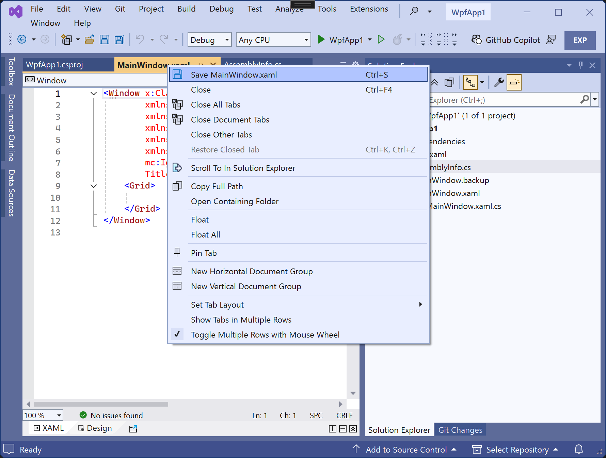
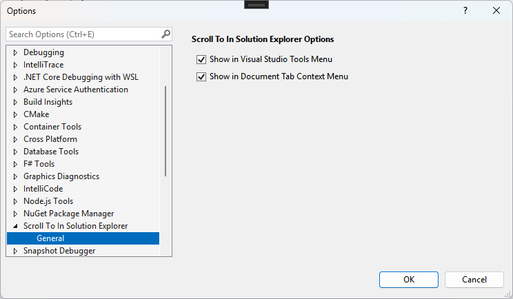

# Scroll To in Visual Studio Solution Explorer Extension (VSIX) for Visual Studio 2022

    

## Visual Studio Marketplace: [Scroll To In Solution Explorer](https://marketplace.visualstudio.com/items?itemName=ErnieSalazar.ScrollToInSolutionExplorer)

I wanted something similar to Reshraper's ability to navigate to the file in Solution Explorer.  I normally run with syncing selection turned off so finding the file after moving around can be combersome.  This is a pretty simiple implementation that triggers the `SyncWithActiveDocument` command native to Visual Studio.

By default, the icon will be added to the Context ("right-click") menu of the Document Tabs (where applicable) and the Tools menu.  These options can be hidden via Tools > Options.  Also, a custom Toolbar "Scroll To In Solution Explorer" is avilable.

I welcome any comments, questions, or contributions.

    
    

